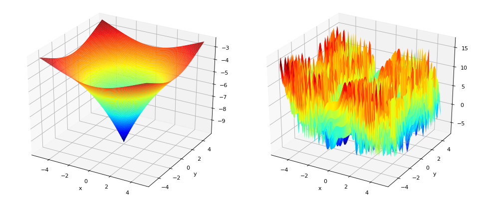

# Notes

## Exercise 1

**Kursawe Objective functions**

### _What happens when you run the GA with this fitness function?_

If the GA is run with this specific configuration of combining two functions into a single fitness one with weights = [0.5, 0.5], then initially the fitness is very high (around 8-9) especially in the worst individuals. Then, as it can be seen, it makes rapid progress in improving both objective functions. After around 1000 evaluations, the rate of improvement is slowed down as the algorithm converges towards an optimal solution, which tries to achieve the best possible fitness goals in both functions (i.e no improvements are made).

### _Why do you obtain this result?_

This result is obtained since two different objective functions are combined into a single one with equal weights, meaning that the GA is trying to optimize them both equally. After around 1000 evaluations, the algorithm struggles to improve the fitness, since the objectives relative scaling is pretty much different (f1 tends to produce negative values, while f2 instead tends to produce positive values due to the sine function)

### _What happens if you give the first (or second) objective all of the weight?_

If an objective function get all of the weights (i.e. weight = 1), then the multi-obejctive GA problem essentially turns into a single-objective optimization problem. This means that the algorithm tries to achieve better fitness only on the specified function, and the associated results will be highly optimized for that particular objective.

### _Can you find a weighting able to find a solution that approaches the optimum on both objectives?_ 

In my opinion, the best overall performance is achieved when both objectives are assigned equal weights, either with additive or multiplicative method. In this way, it sure that the results aren't skewed towards a certain objective. However, I noticed that significant results can also be obtained by increasing the weight of the second objective, for example, using weights of [0.4, 0.7] or [0.3, 0.7]. In these cases, the best individuals are typically found more quickly, stabilizing around 1000 evaluations. This may occur because greater emphasis is placed on the second objective, which tends to yield higher positive values initially, leading to better solutions in fewer evaluations.

### _Does your weighting still work on the new problem?_

Also here, I think that the best weighting is achieved when all the objectives are assigned equal weights, since it's more balanced, but little slower compared in terms of convergence compared to an approach where the last objective gets the higher weight (e.g. weights = [0.3, 0.3, 0.4] or also [0.25, 0.25, 0.5]).

**Note** It seems that privileging complex functions with higher weights tends to stabilize the results faster, but the overall best solution is slightly penalized. 

### _Can you think of a method for combining the objectives that might work better than using a weighted sum?_

While the combination of multiple objective functions into a single one using a weighted sum is easy to understand and implement, I still think that other techniques such as NSGA2 perfoms better. However, if the focus is the combination of multiple objectives into a single one, then a better approach would be an **adaptive weighting**, which is similar to an additive weighting, but with weights that change and adapt over time. With this approach, the algorithm can give much importance to certain objectives in the early stages, and dynamically adjust the weights of the other functions in the middle stages.

## Exercise 2

### _How do the solutions you find here compare to those found in exercise 1?_

In Exercise 1, the objectives were combined into a single fitness function by assigning weights to each of them. In this exercise, instead, NSGA2 evolves a Pareto-set of non-dominated solutions. These solutions represent different trade-offs between the objectives, rather than focusing on a single weighted sum as in Exercise 1. As can be seen in the plotted figure, the two objectives seem proportionally inverse. In fact, lower values for f1 leads to higher values for f0 and viceversa. This happens because, as we already saw in the first exercise, the two objectives have different relative scaling.

### _Is there a single solution that is clearly the best?_

No, there isn't any solution that is clearly the best, since each solutions in the Pareto front is optimal for a certain balance of the objectives. If I would need to pick one, then the candidate would need to be searched in the middle of the front [-18, -15], since it represents a good trade-off between the objectives.

### _Can you still find good solutions?_

It depends. For example, in the middle-left plot where f0 is compared against f1, then it can clearly be seen that the bottom-left cluster of points represents a set of good solutions, since all of them minimize the two objectives. On the other hand, the comparison between f0/f1 againts f2 is harder: it's not clear if there is a solution that is the best, since a first set of points minimize the first objective, while the other the second objective.

### _What happens if you increase the population size or the number of generations?_

If the population size is increased, then the initial set of solutions would be more diverse, which may help the algorithm in exploring better the search space. If the number of generations is increased, then there will be more iterations to refine the new solutions and so to achieve better results. If both are increased, then the resulting sets of solutions would be better defined and more dense.

## Exercise 3

### _Is the algorithm able to find reasonable solutions to this problem? Use what you have learned about population sizes and number of generations to improve the quality of the found solutions._

The algorithm seems to find reasonable solutions to this problem, as highlighted by the Pareto front plotted. This shows a set of trade-off solutions between the two objectives: minimizing brake mass (f0) and minimizing stopping time (f1). With the provided population size of 10 and a maximum of 10 generations, the algorithm is able to find a set of reasonable, but limited solutions for the disk brake design problem. From previous exercises, I saw that reasonable numbers for population and generations would be respectively 50 and 100. By setting this values, the Pareto front covers a wider range of solutions.

### _Do you see any patterns in the Pareto-optimal solutions that may help you in designing a well-performing disk-brake in the future?_

From the plotted Pareto front, it is clear that there's is an inverse relationship between the two objectives. As the mass f0 decreases, the stopping time f1 increases and viceversa. This translates in "lighter brake results in worse performance of stopping time". For a future design of this system, I think there's a need to a trade-off between the twos: for example, if the car has a limiting mass, then we may accept longer stopping time and viceversa. Another thing to note is that in certain points, if the mass is reduced slightly, the time is increased by a small amount. So these solutions need to be taken into account and considered acceptable.

## Final questions

### _When do you think it is appropriate to use a multi-objective evolutionary algorithm vs. combining multiple objectives into a single fitness function?_

Multi-objective EA should be used when conflicting objectives are present or when there's no indication on which objective to prefer wrt the others: this allow to generate the Pareto-front to show the trade-off between them. Instead, it makes more sense to combine multiple objective into a single one when it's clear that one objective has more importance than the others.

### _What can the results of a multi-objective algorithm teach us about exploring the design spaces of engineering problems?_

As shown in the previous exercises, the multi-objective EA often improve a solution at the cost of another one. This helps in understanding the relationship between the objectives and how they interact with one another.

### _In biological evolution it is possible to think of many phenotypic traits that contribute to the ultimate fitness of an organism (try to enumerate some of these). What (if any) relevance do multi-objective evolutionary algorithms have to biology?_

Some phenotypic traits that contribute to the fitness of an organism may include survival traits like strenght, speed or camouflage and helth-related traits like immunity or resistance to certain bacteria. I think that multi-objective EA directly correlate with biology, since organisms, as they evolve, must balance different traits in order to survive, like the ones beforementioned.             