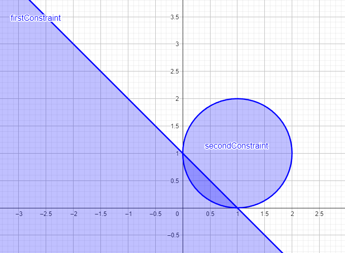

# Notes

## Exercise 1

### _How do your results change from the unconstrained version (from the previous lab)?_

As can be seen from the two different plots, in the constrained version the number of "good" solutions is reduced. In the unconstrained version, the Pareto-front presents some solutions that offer a good balance between the two objectives. In contrast, in the constrained version, solutions present worse trade-offs between f0 and f1, resulting in a Pareto-front that is not well-defined. This may happen because some areas of the unconstrained version are now excluded in the constrained one due to costraint violations, leading to a smaller set of optimal solutions.

### _Do your previous parameters continue to solve the problem? (Try to increase the population size and/or the number of generations to see if you can find better solutions)._

As in the unconstrained version, by adjusting parameters like population size and the number of generations, it is possible to achieve better results. For instance, when the population size is increased to 50 and the maximum number of generations to 100, a more diverse set of solutions is found. In this specific case, the Pareto-front becomes more well-defined and similar to what was obtained in the previous lab. However, the constrained version still produces fewer optimal solutions compared to the unconstrained case, since some solutions are discarded due to constraint violations.

## Exercise 2

### _Do you see any difference in the GA’s behavior (and results) when the penalty is enabled or disabled?_

When the penalty function is enabled, the search behavior changes. With the penalty disabled, the GA explores a larger portion of the search space, leading to more fluctuation in fitness values since it doesn't avoid infeasible solutions. This leads to a faster initial progress, as the algorithm optimizes the objective function without considering the constraints. However, without penalties, the GA will likely converge to infeasible solutions. On the other hand, when the penalty is enabled, the GA focuses more on finding feasible solutions, which slows the initial progress, but ensures that the final solution respects the constraints. Although the search may be slower, the penalized GA is more likely to find a feasible that satisfies all the constraints.

### _Try to modify the penalty functions used in the code of each benchmark function, and/or change the main parameters of the GA. Are you able to find the optimum on all the benchmark functions you tested?_

### _Is the GA able to find the optimal solution lying on the unit circle? If not, try to change some of the GA’s parameters to reach the optimum._

No, the GA is not able to find a solution that lies on the unit circle. It does a pretty good job finding solutions with fitness that is 0.99, but none of them lies on the circle. However, by increasing or adjusting the GA paremeters, closer solutions to the optimum are found, with the best overall fitness of 0.999999...

### _By default, the sphere function is defined in a domain [−5.12, 5.12] along each dimension. Try to increase the search space to progressively increasing boundaries (e.g. [−10, 10], [−20, 20], etc.). Is the GA still able to explore the feasible region and find the optimum?_

It depends. For boundaries like [-10, 10] or [-20, 20] the GA is still able to find the optimal solutions, but if they are further increased, then the GA won't be able to find any.

### _If not, try to think of a way to guide the GA towards the feasible region. How could you change the penalty function to do so?_

In order to handle larger search spaces, then the penalty can be further decreased. For example, if the penalty is set to be -1.5 * g1, then all the infeasible solutions will be strongly penalized and the results will be inside the feasible region with the constraint be respected.

### _Try to modify the sphere function problem by adding one or more linear/non-linear constraints, and analyze how the optimum changes depending on the presence of constraints._

In the unconstrained version, the objective is minimized when both x and y are zero. Therefore, the global optimum is at (0, 0). With the introduction og the first linear constrain g1, the search space is limited to the region where the sum(x,y) <= 1. In this case, the previous optimum still is a feasible solution. On the other hand, when the second circular constraint is introduced, solutions have been limited inside a circle with center in (1, 1). This scenario moves the global optimum from the previous (0,0) to (1,1), being that the feasible region has moved away. In order to make solutions lie inside that space, a bigger penalty has been introduced. This overall produces solutions that lie inside the intersection of the two constraints, resulting in the new global optimum in (0.3, 0.3), as depicted in the following plot.

## Final questions

### _What do you think is the most efficient way to handle constraints in EAs?_

I think that the most efficient way to handle constraints in EAs is to properly find **optimal penalties** that can drive solutions inside the feasible region using penalty terms that grow based on the degree of violation. Therefore, after defining all the constraints subject to a problem, then the best approach to handle them would be to find appropriate penalty functions. As seen in class, other methods would be **feasibility-based ranking (stochastic ranking)** or **repair functions**.

### _Do you think that the presence of constraints makes the search always more difficult? Can you think of cases in which the constraints could actually make the search easier?_

In general, I would say that the presence of constraints makes the search more difficult due to limited feasible space caused by constraints that can be very complex to understand. However, constraints can also be helpful in those cases where solutions need to be guided towards a particular region. For example, if a architectural problem needs to be optimized within certain security limits, then the constraints are crucial in order to not wast time in evaluating harmful designs. On the other hand, the presence of constraints, if there are many, can make the search of solutions really hard.